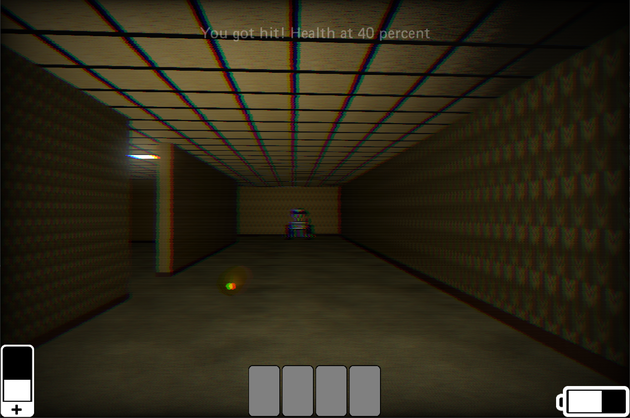

# GetOut

Entry for LibGDX Game Jam #30
Theme: The Four Elements
September 2024

A [libGDX](https://libgdx.com/) project generated with [gdx-liftoff](https://github.com/libgdx/gdx-liftoff).

Done:
- collision detection
- recognize specific colliders to interact (cards, exit).
- pickup cards
- show cards in HUD
- activate exit
- add col det for outer wall
- key bindings menu
- main menu
- fps indicator
- settings menu
- easter egg
- block robot from seeing you through walls
- free look option
- randomized spawn points
- start screen
- increased ceiling height to 3m
- 
Notes:
- textures need to be power of two for teavm version
- mouse capture doesn't work on web version, user wil have to use keyboard (A/D) to turn instead of mouse.
- ESC is not handy for web. Use another key to call menu (and to cancel key binding).

Music:
Music by Oleksii Kaplunskyi (via Pixabay)
VHS font: https://www.fontspace.com/real-vhs-font-f44868

Dev Log: https://monstroussoftware.github.io/2024/09/25/GTHO-post-mortem.html

This project was generated with a template including simple application launchers and a main class extending `Game` that sets the first screen.

## Platforms

- `core`: Main module with the application logic shared by all platforms.
- `lwjgl3`: Primary desktop platform using LWJGL3; was called 'desktop' in older docs.
- `html`: Web platform using GWT and WebGL. Supports only Java projects.
- `teavm`: Experimental web platform using TeaVM and WebGL.
